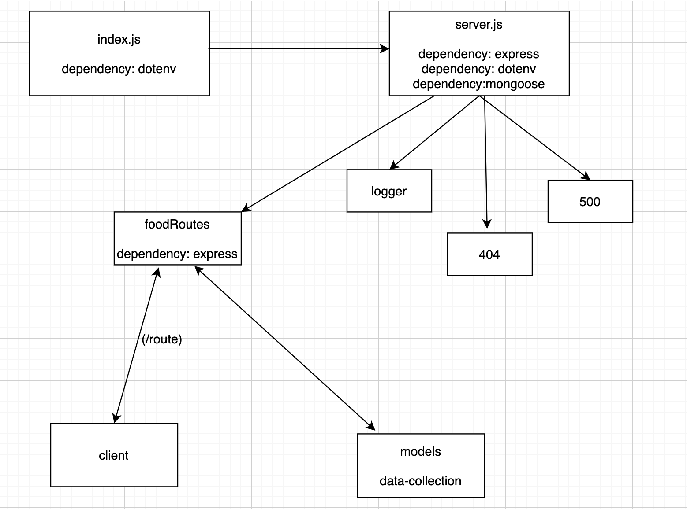

# LAB - Class 04

## Project: Data Modeling

### Author: Mariko Alvarado

### Links and Resources
-  Stacy

Did not figure out mongo for deployment yet.

### Setup

#### `.env` requirements (where applicable)

- `PORT` - 3000
- `MONGODB_URI` - mongodb://localhost:27017/mydb

#### How to initialize/run your application (where applicable)

#### How to use your library (where applicable)

#### Tests

- TEST HAS NOT BEEN CREATED YET

#### UML

